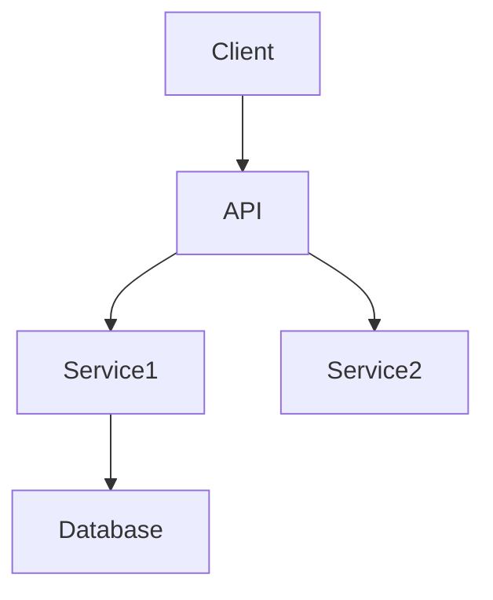

# Arquitetura Example

Este é um exemplo dentro da seção **Arquitetura**.  
Aqui você pode explicar diagramas de sistemas, microserviços, ou padrões de design.

```mermaid
graph TD
  Client --> API
  API --> Service1
  API --> Service2
  Service1 --> Database
```
